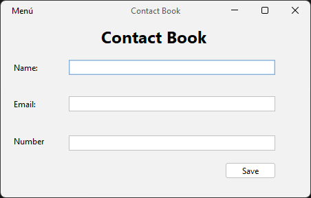
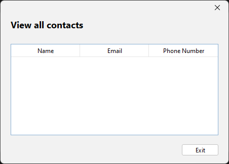

## README para el Proyecto de Agenda en Java

### 1. Descripción del Proyecto

Este proyecto consiste en la creación de una agenda de contactos utilizando Java. La agenda cuenta con una interfaz gráfica de usuario para interactuar con los datos de los contactos.

**Características:**

* Interfaz gráfica de usuario
* Funcionalidad para ingresar nombre, correo electrónico y número de celular de un contacto
* Botón para guardar el contacto ingresado (y limpiar el formulario)
* Menú para mostrar la lista de contactos
* Visualización de los datos de contacto en una tabla





**Importante:** Los datos no se eliminan del archivo, se van almacenando uno a continuación del otro.

### 2. Estructura del Proyecto

El proyecto se divide en los siguientes paquetes:

* **Windows:** Contiene las clases que definen la interfaz gráfica y la lógica del programa.
    * `Person.java`: Define la clase `Persona` que representa a un contacto con sus atributos (nombre, correo electrónico y número de celular).
    * `FileEditor.java`: Contiene métodos para crear y escribir en el archivo de texto que almacena los datos de los contactos.
    * `Agenda.java`: La clase principal del programa que crea la ventana principal y gestiona los eventos de la interfaz.
    * `ViewContacts.java`: Clase que define la ventana para mostrar la lista de contactos en una tabla.
* **img:** Contiene las imágenes utilizadas en la interfaz gráfica.

### 3. Instrucciones de uso

Puedes descargar el ejecutable `.jar` o `.exe` para comenzar a usarlo en la carpeta de la parte de arriba llamada `store` da click en la carpeta y nuevamente sa click sobre el ejecutable de tu interes y descarga.

1. **Clonar el repositorio:**

```bash
git clone https://github.com/jangelmm/agenda-contactos-java.git
```

2. **Compilar el proyecto:**

Navegar a la carpeta del proyecto y ejecutar el siguiente comando:

```bash
mvn compile
```

3. **Ejecutar el programa:**

Ejecutar el siguiente comando:

```bash
mvn exec:java
```

4. **Uso de la agenda:**

* **Agregar un contacto:**
    1. Llenar los campos de nombre, correo electrónico y número de celular en el formulario.
    2. Hacer clic en el botón "Guardar".
    3. El contacto se agregará a la lista y se guardará en el archivo.
* **Mostrar la lista de contactos:**
    1. Seleccionar la opción "Mostrar contactos" del menú.
    2. La lista de contactos se mostrará en una tabla.

### 4. Consideraciones adicionales

* El proyecto está diseñado para funcionar en sistemas operativos Windows.
* Se requiere tener instalado Java Development Kit (JDK) para compilar y ejecutar el programa.
* El código fuente del proyecto está disponible en el repositorio de GitHub: [https://github.com/jangelmm/agenda-contactos-java](https://github.com/jangelmm/agenda-contactos-java)

### 5. Agradecimientos

Este proyecto fue desarrollado por Jangelmm. Se agradece cualquier comentario o sugerencia para mejorar la aplicación.
